# rEFIndConfigEditor

 A gui config editor for [rEFInd](https://www.rodsbooks.com/refind/), a UEFI boot manager compatible with Linux, MacOS & Windows. 

Create a config with a gui with friendly names, tooltips, and references for each token. Includes some extras like theme management and a theme browser. Covers every setting listed on the [config file instruction page](https://www.rodsbooks.com/refind/configfile.html), with links for each. 

<!-- Quick Reference --
version = 1.0.0

x64Installer = https://github.com/fosterbarnes/rEFIndConfigEditor/releases/download/v1.0.0/rEFIndConfigEditorInstaller_v1.0.0_x64.exe

x64Portable = https://github.com/fosterbarnes/rEFIndConfigEditor/releases/download/v1.0.0/rEFIndConfigEditorPortable_v1.0.0_x64.zip

x86Installer = https://github.com/fosterbarnes/rEFIndConfigEditor/releases/download/v1.0.0/rEFIndConfigEditorInstaller_v1.0.0_x86.exe

x86Portable = https://github.com/fosterbarnes/rEFIndConfigEditor/releases/download/v1.0.0/rEFIndConfigEditorPortable_v1.0.0_x86.zip

ARM64Installer = https://github.com/fosterbarnes/rEFIndConfigEditor/releases/download/v1.0.0/rEFIndConfigEditorInstaller_v1.0.0_arm64.exe

ARM64Portable = https://github.com/fosterbarnes/rEFIndConfigEditor/releases/download/v1.0.0/rEFIndConfigEditorPortable_v1.0.0_arm64.zip
-->

  

| <h3>General</h3> |
|:---:|
| 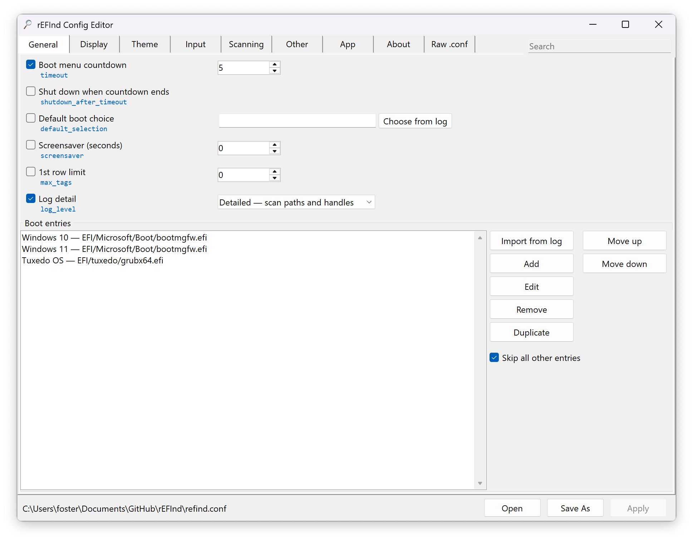 |

## Downloads

<table border="0">
<tbody>
<tr>
<td align="center" valign="top"></td>
<td align="center" valign="top"><a href="https://github.com/fosterbarnes/rEFIndConfigEditor/releases/download/v1.0.0/rEFIndConfigEditorInstaller_v1.0.0_x86.exe">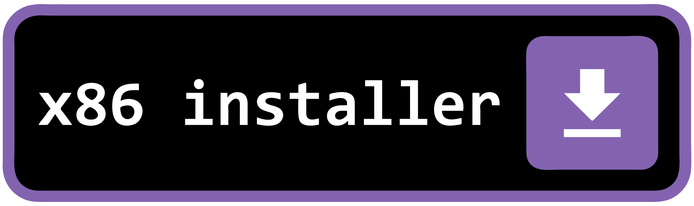</a></td>
<td align="center" valign="top"></td>
</tr>
</tbody>
</table>

<table border="0">
<tbody>
<tr>
<td align="center" valign="top"><a href="https://github.com/fosterbarnes/rEFIndConfigEditor/releases/download/v1.0.0/rEFIndConfigEditorPortable_v1.0.0_x64.zip">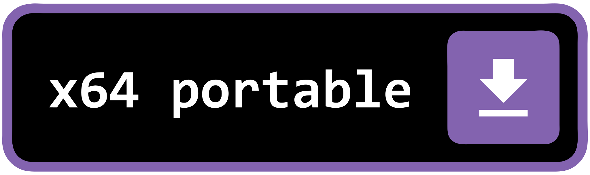</a></td>
<td align="center" valign="top"></td>
<td align="center" valign="top"><a href="https://github.com/fosterbarnes/rEFIndConfigEditor/releases/download/v1.0.0/rEFIndConfigEditorPortable_v1.0.0_arm64.zip">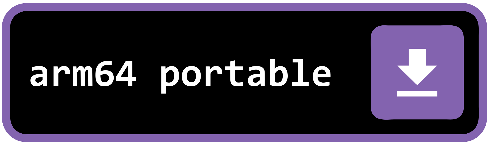</a></td>
</tr>
</tbody>
</table>

## Tabs

[Click to Expand]

| <h3>General</h3> |
|:---:|
|  |

| <h3>Display</h3> |
|:---:|
| 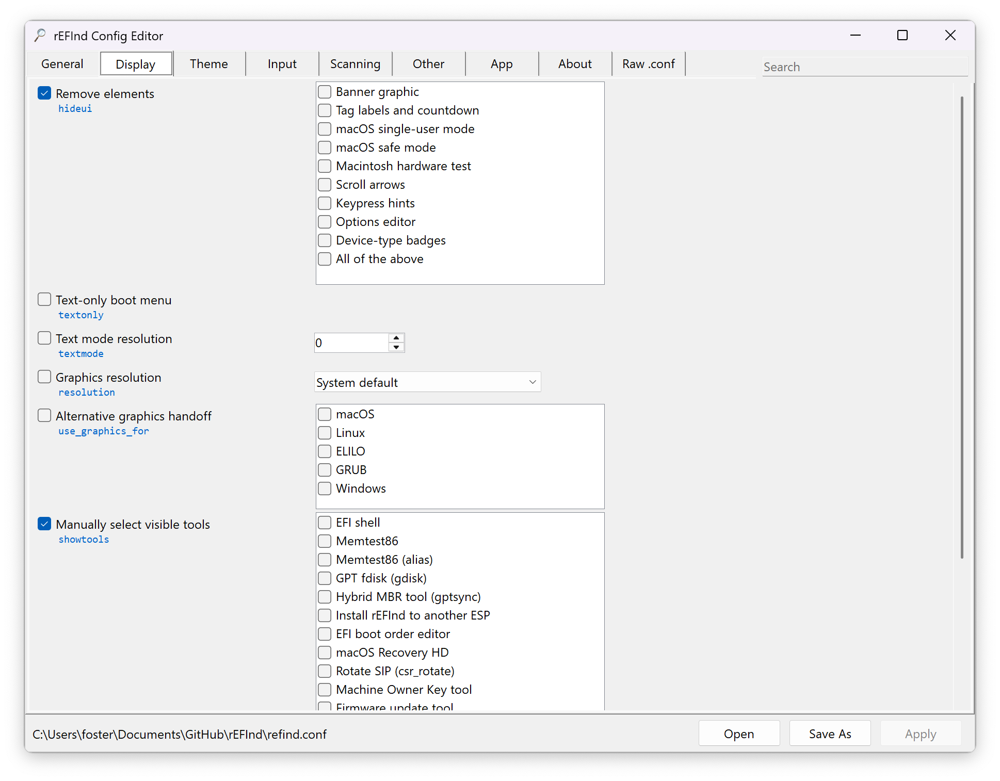 |

| <h3>Theme</h3> |
|:---:|
| 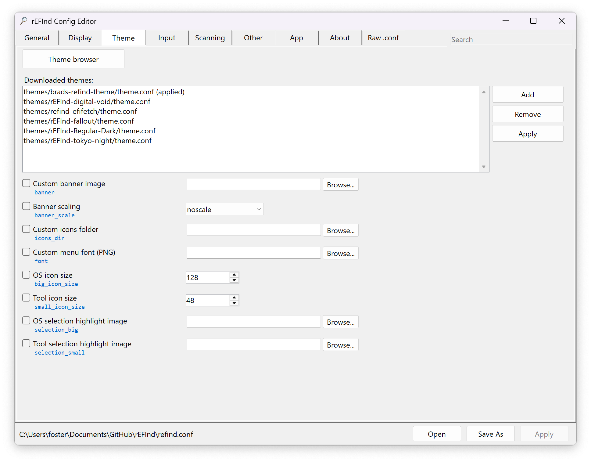 |

| <h3>Input</h3> |
|:---:|
| 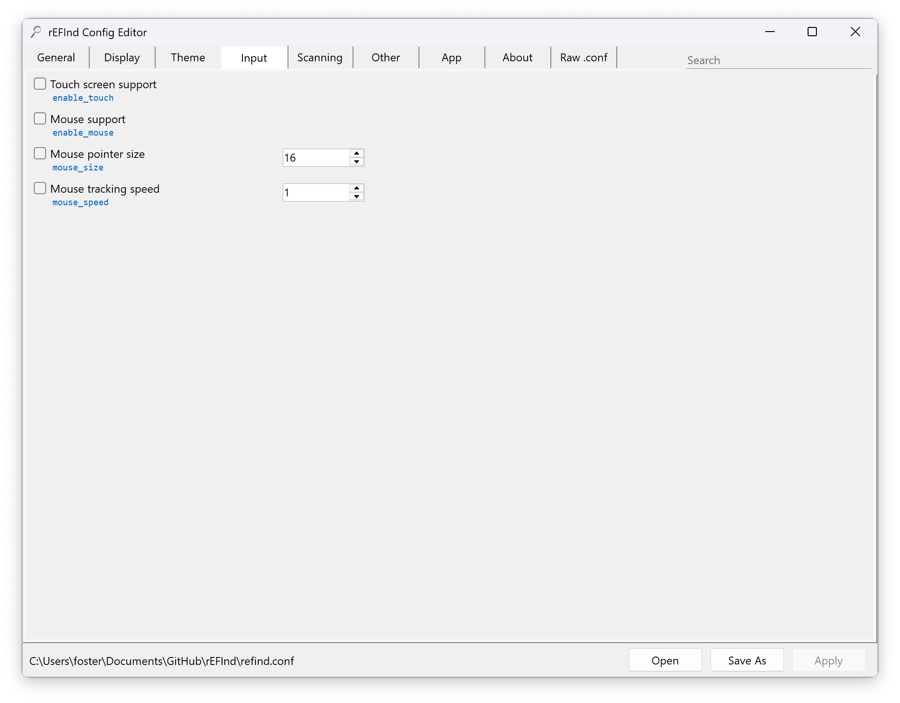 |

| <h3>Scanning</h3> |
|:---:|
| 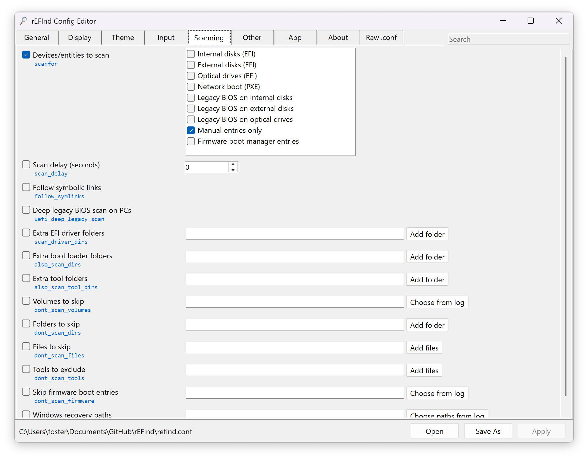 |

| <h3>Other</h3> |
|:---:|
| 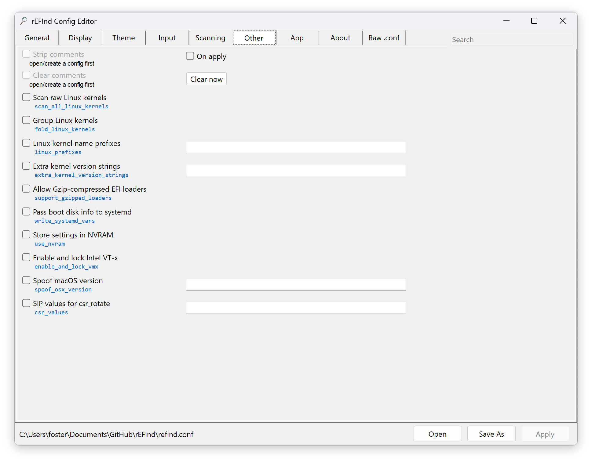 |

| <h3>App</h3> |
|:---:|
| 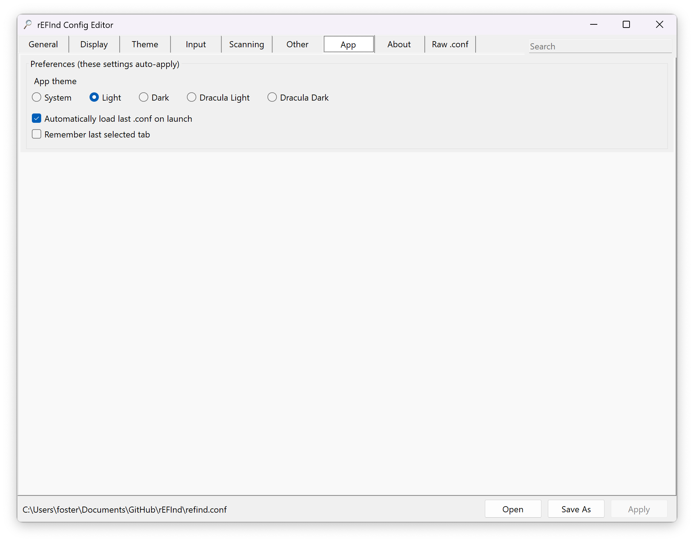 |

| <h3>About</h3> |
|:---:|
| 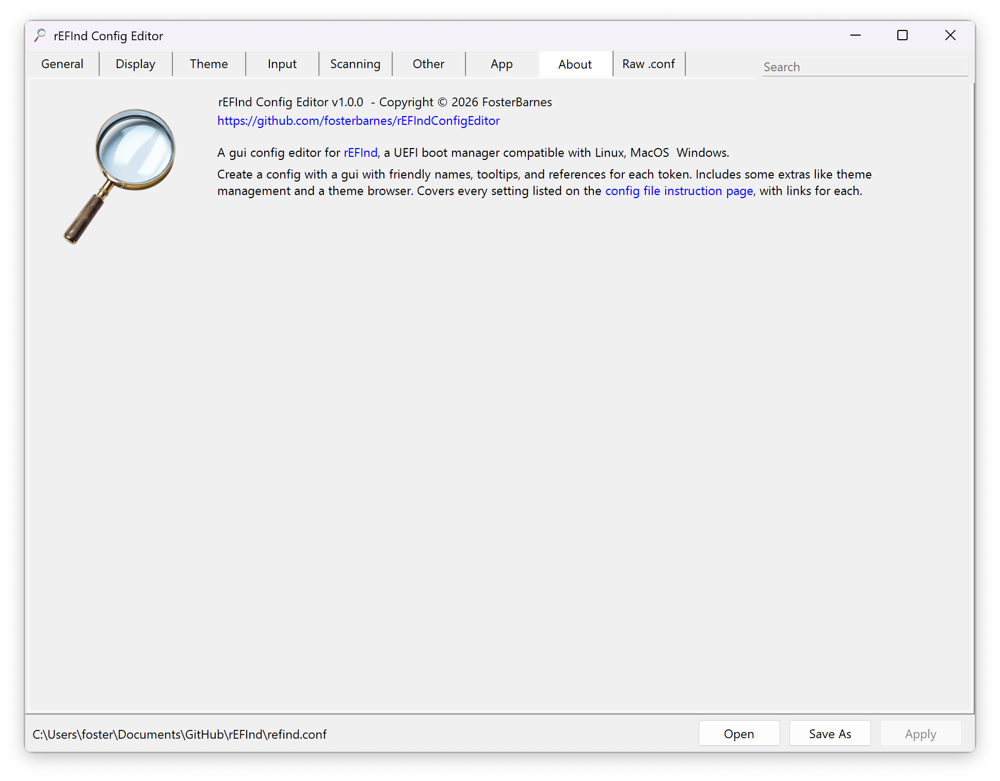 |

| <h3>Raw .conf</h3> |
|:---:|
| 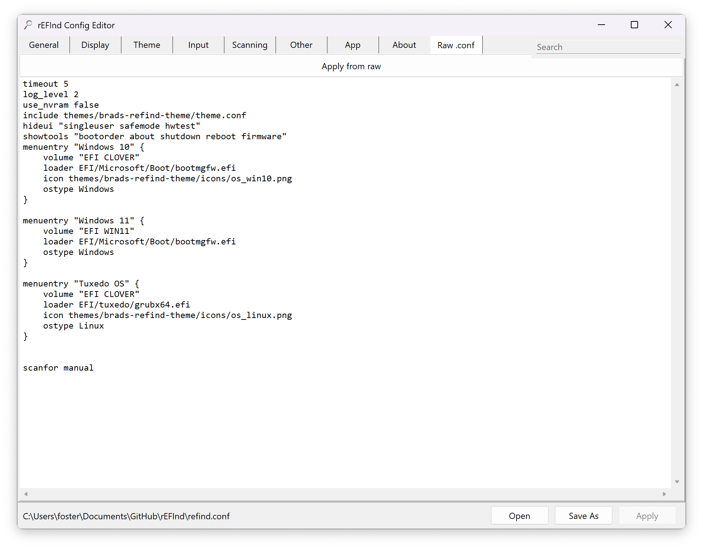 |

## App Themes

[Click to Expand]

| <h3>Light</h3> |
|:---:|
| 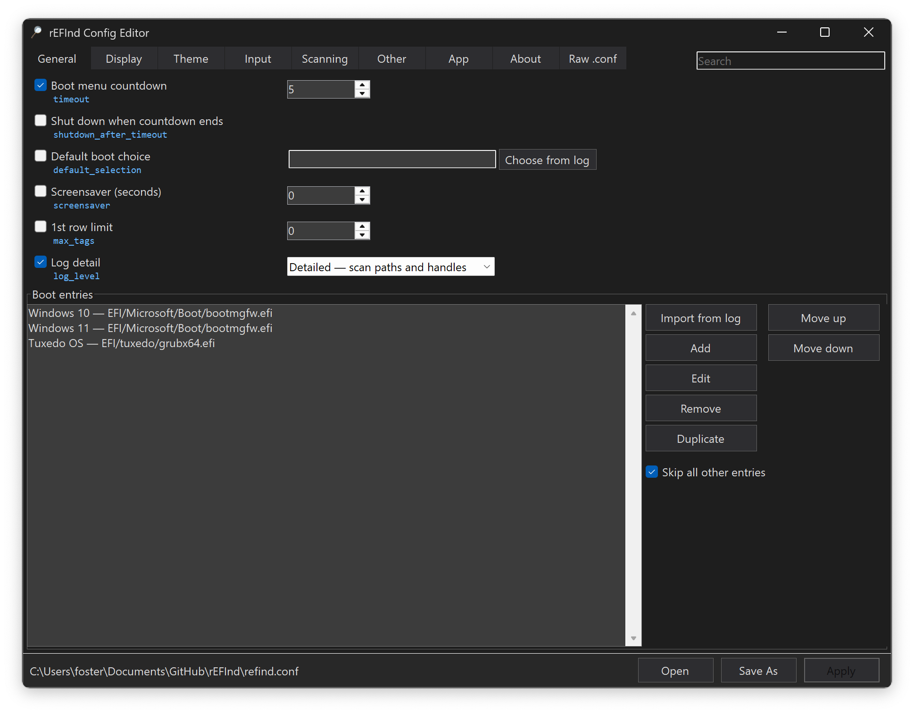 |

| <h3>Dark</h3> |
|:---:|
| 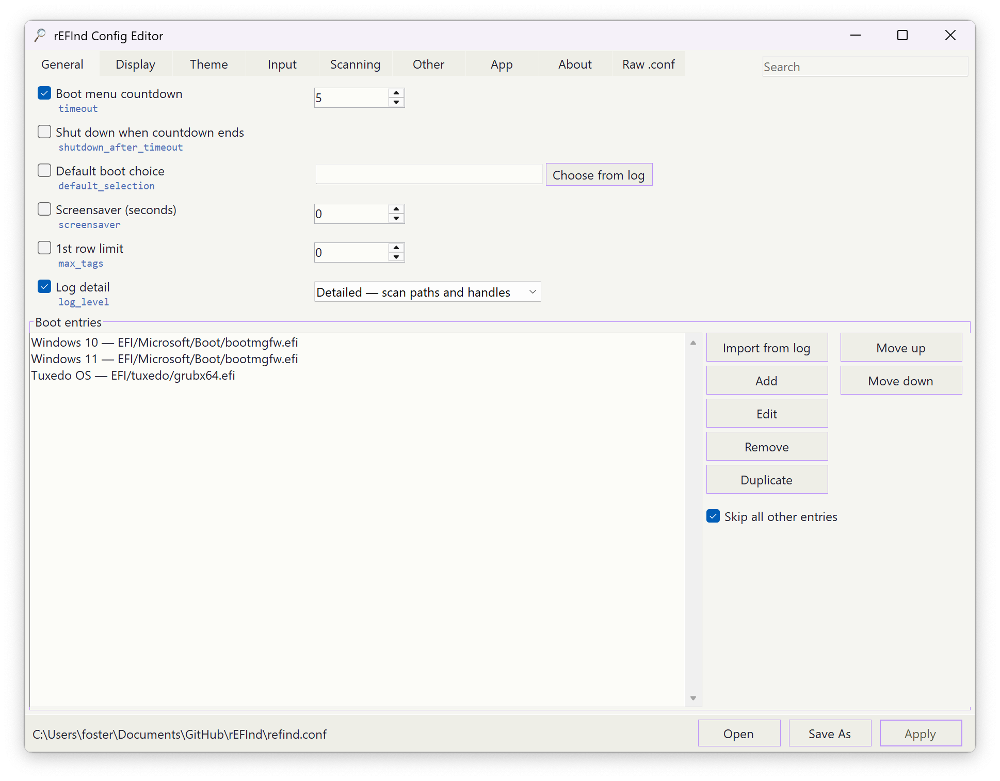 |

| <h3>Dracula Light</h3> |
|:---:|
| 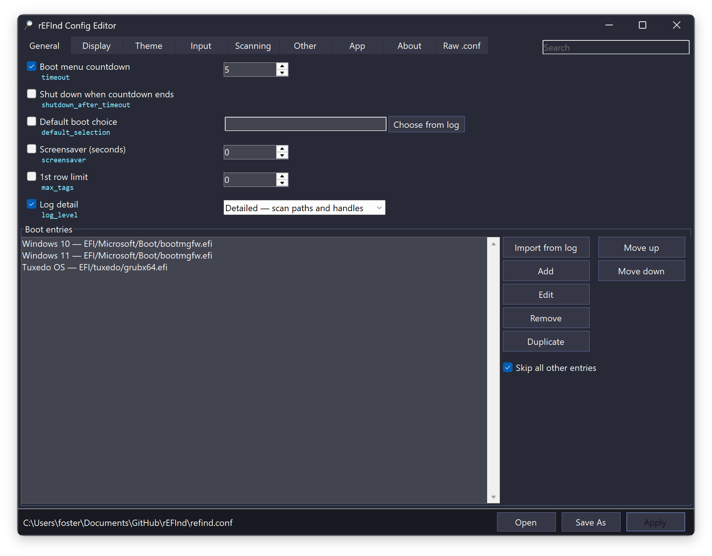 |

| <h3>Dracula Dark</h3> |
|:---:|
|  |

## Requirements

- [.NET 8 Desktop Runtime](https://dotnet.microsoft.com/download/dotnet/8.0) (installers and portable builds are framework-dependent)

## License

MIT — see [LICENSE](LICENSE).

## Compatibility

| Platform  | Architecture   |
|------------|-----------------|
| Windows 10 | x86, x64, arm64 |
| Windows 11 | x86, x64, arm64 |
